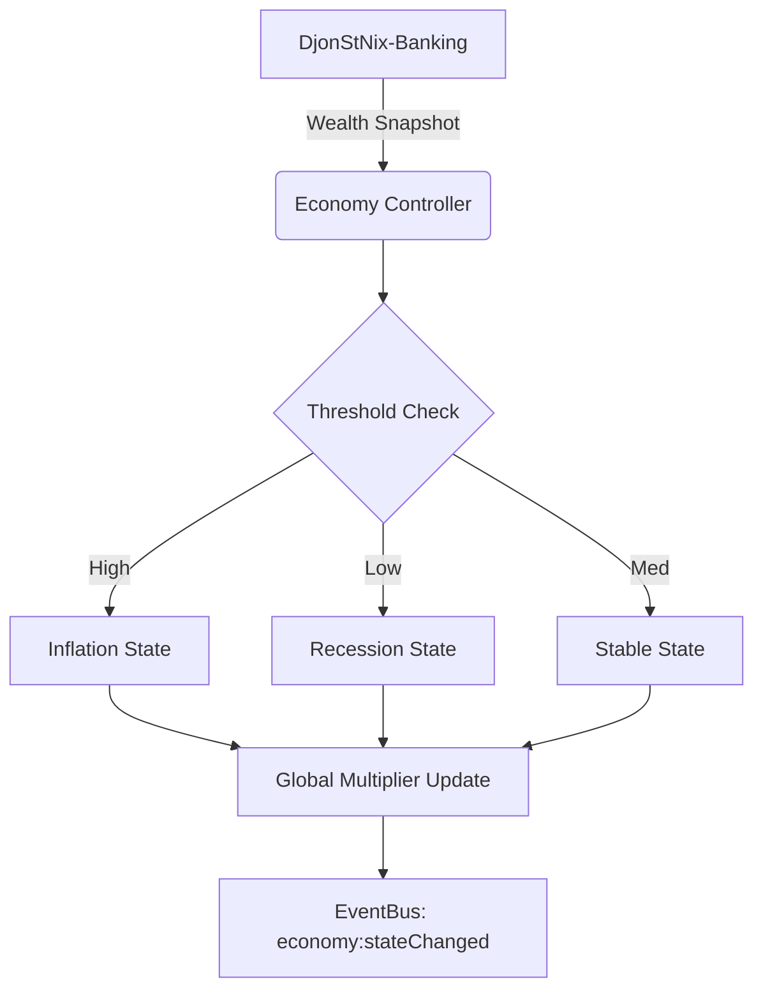

<!-- ==============================================================================
👑 DJONSTNIX BRANDING
==============================================================================
DEVELOPED BY: DjonStNix (DjonLuc)
GITHUB: https://github.com/Djonluc
DISCORD: https://discord.gg/s7GPUHWrS7
YOUTUBE: https://www.youtube.com/@Djonluc
EMAIL: djonstnix@gmail.com
LICENSE: MIT License (c) 2026 DjonStNix (DjonLuc)
============================================================================== -->

# 📈 djonstnix-economy

### Macro-Economic Simulator & Adaptive Engine for the DjonStNix Ecosystem

**djonstnix-economy** is the "brain" of server valuation. It monitors global wealth patterns, identifies inflation or recession states, and broadcasts price multipliers to the rest of the ecosystem.


---

## 📖 Overview

The Economy Engine is the analytical core of the DjonStNix suite. It solves the problem of "infinite money" by dynamically adjusting the purchasing power of the server currency. By monitoring the total money supply in Banking, it can automatically trigger state changes that make goods more expensive during inflation or cheaper during economic downturns.

---

## 🧠 Architecture

Economy uses an "Observer-Broadcaster" architecture. It periodically samples the global wealth from the Banking ledger and computes a state based on configured thresholds.



---

## ✨ Features

- 📊 **Inflation Monitoring:** Real-time analysis of server-wide cash and bank balances to determine "Economic Pressure."
- ⚖️ **Unified Tiered Economy:** Linking price multipliers directly to player earning tiers (Starter, Professional, Veteran, Executive).
- 🕒 **Playtime Tracking:** Fully persistent monitoring of cumulative player activity with adaptive salary adjustments.
- 🔄 **Adaptive Ecosystem:** Dynamically scales prices in Shops, Vehicles, and Missions based on the player's personal economic progression.
- 🛡️ **Anti-Exploit Cap:** Built-in safeguards to prevent runaway inflation from malicious cash injections.
- 📡 **Global Broadcast:** Emits state changes via the Bridge EventBus for cross-script reactions.

---

## 🔗 Recommended Integrations

This script is highly recommended to be used with:

| Resource                                                                                   | Purpose                                                                              |
| :----------------------------------------------------------------------------------------- | :----------------------------------------------------------------------------------- |
| **[DjonStNix-Bridge](https://github.com/Djonluc/DjonStNix-Bridge)**                        | Required for player and framework abstraction.                                       |
| **[DjonStNix-Banking](https://github.com/Djonluc/DjonStNix-Banking)**                      | Required as the primary data source for the global money supply.                     |
| **[DjonStNix-Shops](https://github.com/Djonluc/DjonStNix-Shops)**                          | Primary consumer of the economy's price multipliers.                                 |
| **[DjonStNix-Government](file:///c:/fivem/Files/resources/[addons]/DjonStNix-Government)** | Links state fiscal policy with macro-economic cycles.                                |
| **[🚗 djonstnix-vehicles](https://github.com/Djonluc/djonstnix-vehicles)**                 | Dynamically scales car and property asset valuations based on current server wealth. |

---

## 📦 Dependencies

- **Required:** `DjonStNix-Bridge`, `DjonStNix-Banking`
- **Optional:** `ox_lib` (For enhanced UI alerts and point-of-sale timers)

---

## 📥 Installation

1.  Place the `djonstnix-economy` folder in your `resources/[addons]/` or `resources/[djonstnix]/` directory.
2.  Ensure it starts **after** `DjonStNix-Banking` in your `server.cfg`.
3.  Configure your `ActiveProfile` and thresholds in `config.lua`.
4.  Restart your server or `ensure djonstnix-economy`.

#### 📝 server.cfg Snippet

```cfg
# DjonStNix Macro Engine
ensure DjonStNix-Bridge
ensure DjonStNix-Banking
ensure djonstnix-economy
```

---

## ⚙️ Configuration

Located in `config.lua`:

```lua
Config.EconomyBalance = {
    Enabled = true,
    ActiveTier = 'starter',
    Tiers = {
        ['starter'] = {
            weeklyTarget = 100000,
            shopMultiplier = 1.0,
            -- ...
        },
        -- ...
    }
}
```

---

## 🗄️ Database Setup

This resource require tables for balancing history and player playtime tracking.

### Installation

Open your database manager (HeidiSQL, phpMyAdmin, etc.) and run the SQL file located at:
`sql/schema.sql`

The engine will also automatically attempt to migrate and create missing tables on startup to ensure backward compatibility.

---

## 💻 Commands

| Command            | Description                                                                          | Permission |
| :----------------- | :----------------------------------------------------------------------------------- | :--------- |
| `/economy`         | Displays detailed economic telemetry in the console                                  | Admin      |
| `/seteconomystate` | Manually overrides the current economic state                                        | Admin      |
| `/economy:admin`   | Professional `ox_lib` menu to adjust Weekly Targets, Cycle Days, and Playtime Goals. | Admin      |
| `/economytest`     | Executes a stress test of the pricing math                                           | Admin      |

---

## 🔌 Exports

```lua
-- Returns the price adjusted by the current multiplier
exports['djonstnix-economy']:GetAdjustedPrice(basePrice, category, citizenid)

-- Example usage:
-- category can be "shop", "vehicle", "mission", or "paycheck"
-- local finalCost = exports['djonstnix-economy']:GetAdjustedPrice(1000, "shop", "ABC12345")

-- Returns the full state snapshot
exports['djonstnix-economy']:GetSnapshotState()
```

---

## 📡 Events

| Event                        | Direction    | Description                                          |
| :--------------------------- | :----------- | :--------------------------------------------------- |
| `economy:stateChanged`       | Server (Bus) | Fired when the server enters Inflation or Recession. |
| `economy:client:NotifyState` | Client       | Standardized notification for economic shifts.       |

---

## 🧪 Testing / Debug Tools

- **`/economytest`**: Diagnostic tool to verify:
  - Connectivity to the Banking snapshot export.
  - Multiplier calculation accuracy for different categories.
  - EventBus latency for state broadcast.

---

## 🛠 Troubleshooting

- **"Current State: stable" (and won't change)**: Check if the total server wealth is within your thresholds; increase the wealth or lower the threshold to test.
- **Snapshot Errors**: Ensure `DjonStNix-Banking` is started and the player cache is fully loaded.
- **Prices Not Adjusting**: Verify that the consuming script (e.g., Shops) is using the `GetAdjustedPrice` export.

---

## 🔐 Permissions & Security

- **ReadOnly Logic**: The economy engine only observes wealth; it can never modify player balances directly.
- **Interpolated Transitions**: State changes are smoothed over time to prevent sudden price shocks.
- **Secure Overrides**: State override commands are restricted to high-level administrators only.

---

## 👤 Author

**DjonLuc**
Founder of the DjonStNix Ecosystem

[GitHub](https://github.com/Djonluc) | [Discord](https://discord.gg/s7GPUHWrS7)

---

## 📜 License

MIT License © 2026 **DjonStNix Ecosystem**. All rights reserved.
